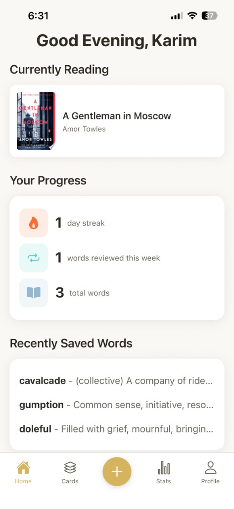
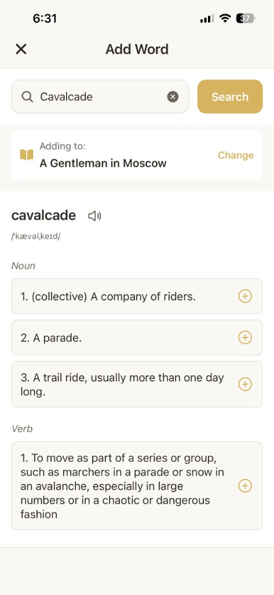
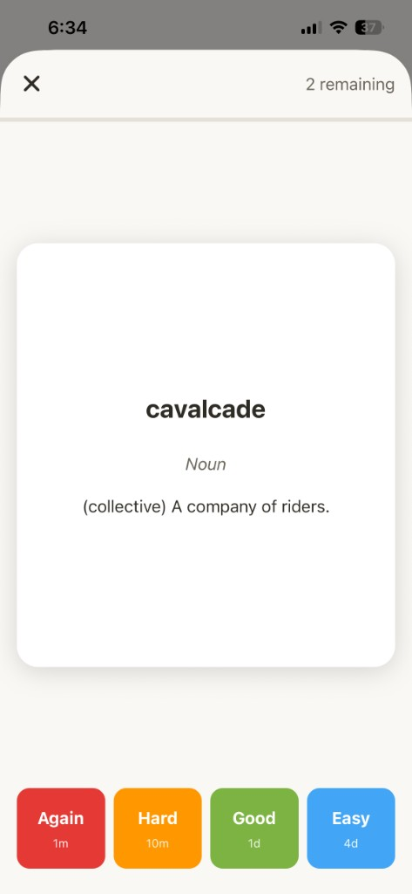
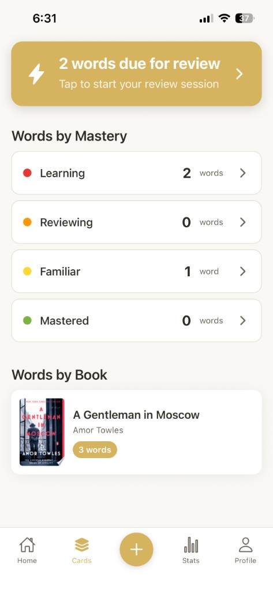
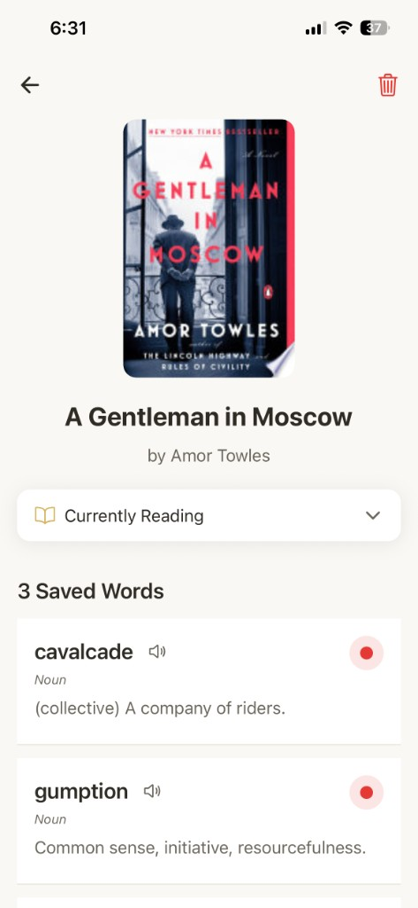
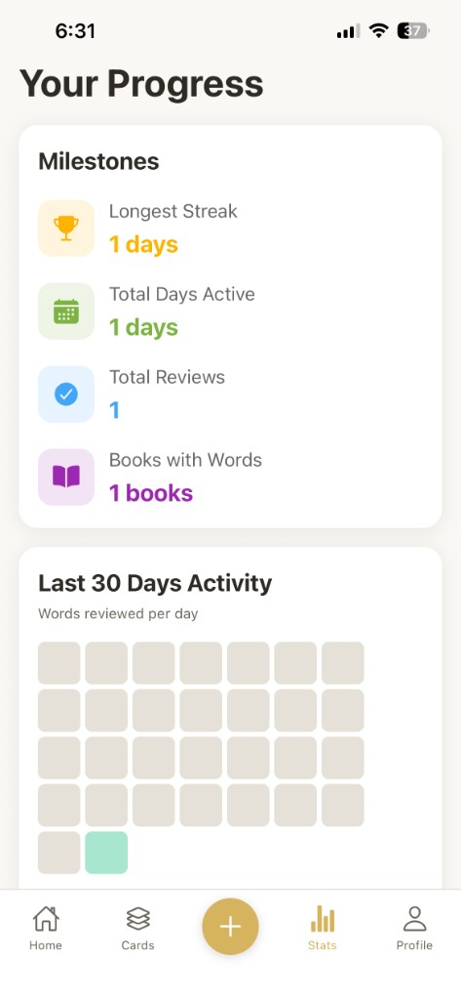

# WordVault

WordVault is a vocabulary learning application designed for readers who want to remember and master new words they encounter while reading. The app combines vocabulary tracking with spaced repetition to help users build a lasting vocabulary from the books they read.

<p align="center">
  
</p>

## Screenshots

<p align="center">
  
  
  
</p>

<p align="center">
  
  
  
</p>

## Overview

When you come across an unfamiliar word in a book, WordVault lets you save it along with its definition and context. The app then uses spaced repetition to help you review and retain these words over time. Each word is associated with the book you found it in, allowing you to track your vocabulary growth across your reading journey.

## Features

- **Word Tracking**: Save words from books with their definitions and context
- **Spaced Repetition**: Review vocabulary using an optimized learning schedule
- **Book Integration**: Link words to specific books and track reading progress
- **Multiple Dictionaries**: Fetch definitions from multiple sources automatically
- **Progress Statistics**: Monitor your vocabulary growth and review performance
- **Google Books Integration**: Search and add books to your library
- **Cross-Platform**: Available on iOS with a web portal for privacy and terms

## Tech Stack

### Mobile (iOS)
- **React Native** with Expo
- **TypeScript** for type safety
- **React Navigation** for routing
- **React Query** (@tanstack/react-query) for server state management
- **AsyncStorage** for local data persistence
- **Expo Secure Store** for secure token storage
- **Apple Sign In** and **Google OAuth** for authentication

### Backend (API)
- **Node.js** with **Express**
- **TypeScript**
- **PostgreSQL** database hosted on Neon
- **JWT** for authentication (access and refresh tokens)
- **node-pg-migrate** for database migrations
- **Docker** for containerization
- Deployed on **Fly.io**

### Web
- **Next.js 16** (App Router)
- **React 19**
- **Tailwind CSS v4** with custom theme
- **TypeScript**
- Deployed on **Netlify**

### Shared
- Monorepo structure with shared TypeScript code
- Shared API client, types, and React Query hooks
- Consistent data layer across web and mobile

## Project Structure

```
wordshelf/
├── mobile/           # React Native iOS app
├── backend/          # Express TypeScript API
├── web/              # Next.js web app
├── shared/           # Shared code (API client, types, hooks)
└── .github/workflows/ # CI/CD pipelines
```

## Authentication

WordVault supports two authentication methods:
- **Sign in with Apple** (iOS)
- **Sign in with Google** (iOS and Web)

Authentication is handled securely through OAuth providers, with JWT tokens (access and refresh) used for API authorization.

## CI/CD

The project uses GitHub Actions for continuous deployment:
- **Backend**: Automatically deploys to Fly.io on changes to `main`
- **Migrations**: Runs database migrations on schema changes
- **Web**: Deploys to Netlify on changes to `main`
- **Mobile**: Builds and submits to TestFlight on version tags

## Development

### Prerequisites
- Node.js 20+
- PostgreSQL (for local development)
- iOS development environment (Xcode, iOS simulator)
- Expo CLI

## Database

The application uses PostgreSQL with the following main entities:
- Users (authentication and profile data)
- Books (user's reading library)
- Words (vocabulary entries with definitions)
- Review sessions (spaced repetition tracking)
- Dictionary cache (cached word definitions)

Migrations are managed with `node-pg-migrate` and run automatically via CI/CD when schema changes are pushed to production.

## Spaced Repetition

WordVault implements a spaced repetition algorithm to optimize vocabulary retention. Words are scheduled for review based on:
- Previous review performance (correct/incorrect)
- Time since last review
- Overall mastery level (Learning, Familiar, Mastered)

The algorithm adjusts review intervals dynamically to focus on words that need more practice while spacing out reviews for well-known words.

## Privacy

WordVault respects user privacy. See the full privacy policy at:
https://wordvaultvocab.netlify.app/privacy

## Terms of Service

View the terms of service at:
https://wordvaultvocab.netlify.app/terms

## License

Copyright © 2026 WordVault

## Contact

For questions or support: wordvaultapplication@gmail.com
